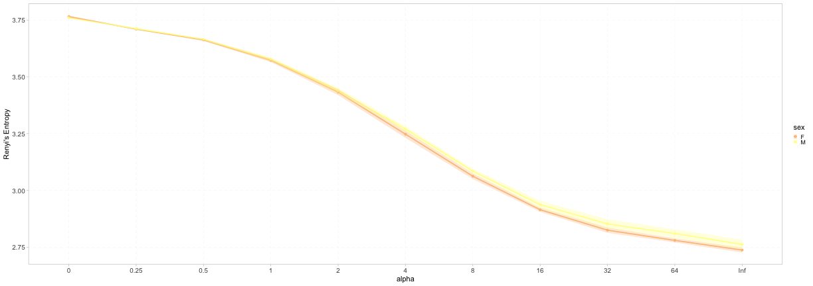
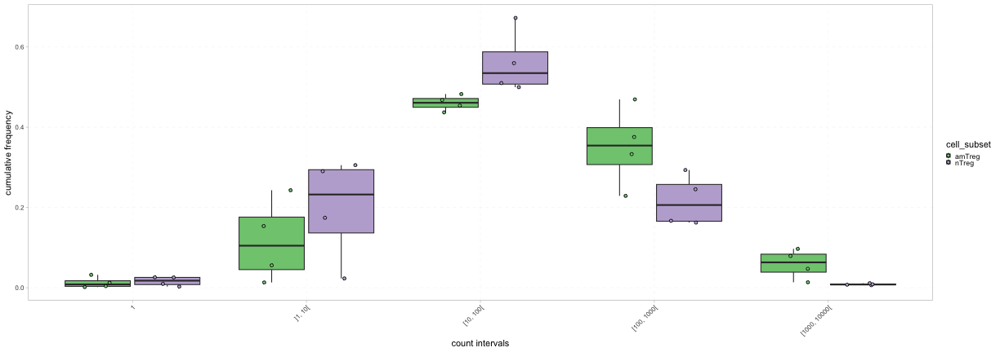

<style type="text/css">
<!-- div#TOC li { -->
<!--     list-style:none; -->
<!--     background-image:none; -->
<!--     background-repeat:none; -->
<!--     background-position:0;  -->
<!-- } -->
 .book .book-body .page-inner  { 
    max-width: 1400px; 
 <!-- width: 120%;  -->
 } 
 .column-left {
  float: left;
  width: 49.7%;
}
.column-right{
 float: right;
  width: 49.7%;
}
.col2 {
    columns: 2 200px;         /* number of columns and width in pixels*/
    -webkit-columns: 2 200px; /* chrome, safari */
    -moz-columns: 2 200px;    /* firefox */
  }
h1 {
  color: #033c73;
   font-size: 30px;
}
h1.title {
  color: #033c73;
}
h2 {
  color: #033c73;
  font-size: 24px;
}
h3 {
   color: #033c73;
   font-size: 18px;
}
h4 {
   color: #022f5a;
}
h5 {
  color: #033c73;
}
h6 {
   color: #033c73;
}
body{ 
  font-size: 14px;
}
p.caption {
  font-size: 0.9em;
  font-style: italic;
  color: grey;
  margin-right: 10%;
  margin-left: 10%;  
  text-align: justify;
} 
#renderedReport p{
  color: white;
}

</style>


<!--html_preserve--><body style="color: white;">
<p style="color: white;">
<div class="form-group shiny-input-container">
<label class="control-label" id="title-label" for="title">Enter title</label>
<input id="title" type="text" class="shiny-input-text form-control" value="Analysis report"/>
</div>
</p>
</body><!--/html_preserve-->


<!--html_preserve--><body style="color: white;">
<p style="color: white;">
<div class="form-group shiny-input-container">
<label class="control-label" id="authors-label" for="authors">Enter authors</label>
<input id="authors" type="text" class="shiny-input-text form-control" value=""/>
</div>
</p>
</body><!--/html_preserve-->


# Exploratory statistics


<!-- ```{r show Detailed repertoire level statistics title, results='asis', echo=FALSE} -->
<!--if(input$countLevel != "" && !is.null(input$countScale)){cat("### Detailed repertoire level statistics")} -->
<!--``` -->

<!-- ```{r count features, echo=FALSE, warning=FALSE, message=FALSE, error=TRUE, fig.width=17, fig.height=6, fig.align='center'} -->
<!-- if(input$countLevel != "" && !is.null(input$countScale)){ -->
<!--    countfeatures <- countFeatures(x=dataFilt(), level = input$countLevel, scale = input$countScale, group = NULL) -->
<!--    knitr::kable(head(countfeatures)) %>% -->
<!--     kableExtra::kable_styling( -->
<!--                     full_width = FALSE, -->
<!--                     position = "center", -->
<!--                     font_size = 10) %>% -->
<!--     kableExtra::row_spec(0, color="#022f5a", font_size = 12)       -->
<!-- } -->

<!-- ``` -->

<!-- ```{r show count features text entry,echo = FALSE} -->
<!-- if(input$countLevel != "" && !is.null(input$countScale)){ -->
<!--   tags$body(style="color: white;", -->
<!--        p(style="color: white;", -->
<!--   textInput("countfeaturesText", "Enter text", value=""))) -->
<!-- } -->
<!-- ``` -->


## Diversity estimation 


<!-- ```{r rarefaction tab,  echo=FALSE, warning=FALSE, message=FALSE, error=TRUE, fig.width=17, fig.height=6, fig.align='center'} -->
<!-- if(!is.null(input$plotRare)){ -->
<!--    raretab <- rarefactionTab(x = dataFilt()) -->
<!--    knitr::kable(head(raretab)) %>% -->
<!--             kableExtra::kable_styling( -->
<!--                     full_width = FALSE, -->
<!--                     position = "center", -->
<!--                     font_size = 10) %>% -->
<!--             kableExtra::row_spec(0, color="#022f5a", font_size = 12) -->
<!-- } -->

<!-- ``` -->


<!-- ```{r div ind tab,  echo=FALSE, warning=FALSE, message=FALSE, error=TRUE, fig.width=17, fig.height=6, fig.align='center'} -->
<!-- if(input$divLevel != ""){ -->
<!--    divind <- diversityIndices(x=dataFilt(), level = input$divLevel) -->
<!--    knitr::kable(head(divind)) %>% -->
<!--             kableExtra::kable_styling( -->
<!--                     full_width = FALSE, -->
<!--                     position = "center", -->
<!--                     font_size = 10) %>% -->
<!--             kableExtra::row_spec(0, color="#022f5a", font_size = 12)  -->
<!-- } -->

<!-- ``` -->


### Renyi index

<div class="figure" style="text-align: center">

<p class="caption">plot of chunk renyi ind</p>
</div>

<!--html_preserve--><body style="color: white;">
<p style="color: white;">
<div class="form-group shiny-input-container">
<label class="control-label" id="renyiindText-label" for="renyiindText">Enter text</label>
<input id="renyiindText" type="text" class="shiny-input-text form-control" value=""/>
</div>
</p>
</body><!--/html_preserve-->


<!-- ```{r renyi ind tab,  echo=FALSE, warning=FALSE, message=FALSE, error=TRUE, fig.width=17, fig.height=6, fig.align='center'} -->
<!-- if(input$renyiLevel != ""){ -->
<!--    renind <- renyiIndex(x=dataFilt(), level = input$renyiLevel) -->
<!--    knitr::kable(head(renind)) %>% -->
<!--             kableExtra::kable_styling( -->
<!--                     full_width = FALSE, -->
<!--                     position = "center", -->
<!--                     font_size = 10) %>% -->
<!--             kableExtra::row_spec(0, color="#022f5a", font_size = 12)  -->
<!-- } -->

<!-- ``` -->


## Clonal distribution


### Per count interval

<div class="figure" style="text-align: center">

<p class="caption">plot of chunk count ind exp</p>
</div>

<!--html_preserve--><body style="color: white;">
<p style="color: white;">
<div class="form-group shiny-input-container">
<label class="control-label" id="countindexpText-label" for="countindexpText">Enter text</label>
<input id="countindexpText" type="text" class="shiny-input-text form-control" value=""/>
</div>
</p>
</body><!--/html_preserve-->


# Multi-sample analysis


## Comparison of basic statistics


### Renyi index

<div class="figure" style="text-align: center">

<p class="caption">plot of chunk renyi</p>
</div>

<!--html_preserve--><body style="color: white;">
<p style="color: white;">
<div class="form-group shiny-input-container">
<label class="control-label" id="renyiText-label" for="renyiText">Enter text</label>
<input id="renyiText" type="text" class="shiny-input-text form-control" value=""/>
</div>
</p>
</body><!--/html_preserve-->


### Count intervals

<div class="figure" style="text-align: center">

<p class="caption">plot of chunk countInt</p>
</div>

<!--html_preserve--><body style="color: white;">
<p style="color: white;">
<div class="form-group shiny-input-container">
<label class="control-label" id="countIntText-label" for="countIntText">Enter text</label>
<input id="countIntText" type="text" class="shiny-input-text form-control" value=""/>
</div>
</p>
</body><!--/html_preserve-->


<!-- ```{r diffExpGroup, echo=FALSE, warning=FALSE, message=FALSE, error=TRUE, fig.width=17, fig.height=6, fig.align='center'} -->
<!-- if(!is.null(input$diffGroup) && !is.null(input$diffLevel)){ -->
<!--     diffexp <- diffExpGroup(x = dataFilt(), colGrp = input$diffGroup[[1]], level = input$diffLevel, group = input$diffGroup) -->
<!--     knitr::kable(head(diffexp)) %>% -->
<!--             kableExtra::kable_styling( -->
<!--                     full_width = FALSE, -->
<!--                     position = "center", -->
<!--                     font_size = 10) %>% -->
<!--             kableExtra::row_spec(0, color="#022f5a", font_size = 12)  -->
<!-- } -->

<!-- ``` -->


<!-- ```{r spectratyping comparison table, echo=FALSE, warning=FALSE, message=FALSE, error=TRUE, fig.width=17, fig.height=6, fig.align='center'} -->
<!-- if(!is.null(input$PertGroupSelected) && !is.null(input$CtrlGroup) && !is.null(input$pertDist) && !is.null(input$pertOrder) && input$doHm == 1){ -->
<!--     sampleinfo <- mData(dataFilt()) -->
<!--     ctrnames <- rownames(sampleinfo)[which(sampleinfo[, input$PertGroupSelected] %in% input$CtrlGroup)] -->
<!--     pertscore <- perturbationScore(x = dataFilt(), ctrl.names = ctrnames, distance = input$pertDist, p = 2) -->
<!--     knitr::kable(head(pertscore)) %>% -->
<!--             kableExtra::kable_styling( -->
<!--                     full_width = FALSE, -->
<!--                     position = "center", -->
<!--                     font_size = 10) %>% -->
<!--             kableExtra::row_spec(0, color="#022f5a", font_size = 12) -->
<!-- } -->

<!-- ``` -->


