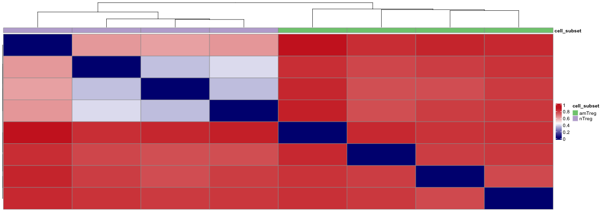

<style type="text/css">
<!-- div#TOC li { -->
<!--     list-style:none; -->
<!--     background-image:none; -->
<!--     background-repeat:none; -->
<!--     background-position:0;  -->
<!-- } -->
 .book .book-body .page-inner  { 
    max-width: 1400px; 
 <!-- width: 120%;  -->
 } 
 .column-left {
  float: left;
  width: 49.7%;
}
.column-right{
 float: right;
  width: 49.7%;
}
.col2 {
    columns: 2 200px;         /* number of columns and width in pixels*/
    -webkit-columns: 2 200px; /* chrome, safari */
    -moz-columns: 2 200px;    /* firefox */
  }
h1 {
  color: #033c73;
   font-size: 30px;
}
h1.title {
  color: #033c73;
}
h2 {
  color: #033c73;
  font-size: 24px;
}
h3 {
   color: #033c73;
   font-size: 18px;
}
h4 {
   color: #022f5a;
}
h5 {
  color: #033c73;
}
h6 {
   color: #033c73;
}
body{ 
  font-size: 14px;
}
p.caption {
  font-size: 0.9em;
  font-style: italic;
  color: grey;
  margin-right: 10%;
  margin-left: 10%;  
  text-align: justify;
} 
#renderedReport p{
  color: white;
}

</style>


<!--html_preserve--><body style="color: white;">
<p style="color: white;">
<div class="form-group shiny-input-container">
<label class="control-label" id="title-label" for="title">Enter title</label>
<input id="title" type="text" class="form-control" value="Analysis report"/>
</div>
</p>
</body><!--/html_preserve-->


<!--html_preserve--><body style="color: white;">
<p style="color: white;">
<div class="form-group shiny-input-container">
<label class="control-label" id="authors-label" for="authors">Enter authors</label>
<input id="authors" type="text" class="form-control" value=""/>
</div>
</p>
</body><!--/html_preserve-->


# Exploratory statistics


## Basic statistics


<!--html_preserve--><body style="color: white;">
<p style="color: white;">
<div class="form-group shiny-input-container">
<label class="control-label" id="metadatastatsText-label" for="metadatastatsText">Enter text</label>
<input id="metadatastatsText" type="text" class="form-control" value=""/>
</div>
</p>
</body><!--/html_preserve-->


### Detailed repertoire level statistics

<table class="table" style="font-size: 10px; width: auto !important; margin-left: auto; margin-right: auto;">
 <thead>
  <tr>
   <th style="text-align:left;color: #022f5a !important;font-size: 12px;"> aaClone </th>
   <th style="text-align:right;color: #022f5a !important;font-size: 12px;"> tripod-26-681 </th>
   <th style="text-align:right;color: #022f5a !important;font-size: 12px;"> tripod-26-682 </th>
   <th style="text-align:right;color: #022f5a !important;font-size: 12px;"> tripod-26-683 </th>
   <th style="text-align:right;color: #022f5a !important;font-size: 12px;"> tripod-27-714 </th>
   <th style="text-align:right;color: #022f5a !important;font-size: 12px;"> tripod-27-715 </th>
   <th style="text-align:right;color: #022f5a !important;font-size: 12px;"> tripod-27-716 </th>
   <th style="text-align:right;color: #022f5a !important;font-size: 12px;"> tripod-30-813 </th>
   <th style="text-align:right;color: #022f5a !important;font-size: 12px;"> tripod-30-814 </th>
   <th style="text-align:right;color: #022f5a !important;font-size: 12px;"> tripod-30-815 </th>
   <th style="text-align:right;color: #022f5a !important;font-size: 12px;"> tripod-31-846 </th>
   <th style="text-align:right;color: #022f5a !important;font-size: 12px;"> tripod-31-847 </th>
   <th style="text-align:right;color: #022f5a !important;font-size: 12px;"> tripod-31-848 </th>
   <th style="text-align:right;color: #022f5a !important;font-size: 12px;"> tripod-35-970 </th>
   <th style="text-align:right;color: #022f5a !important;font-size: 12px;"> tripod-35-971 </th>
   <th style="text-align:right;color: #022f5a !important;font-size: 12px;"> tripod-35-972 </th>
   <th style="text-align:right;color: #022f5a !important;font-size: 12px;"> tripod-36-1003 </th>
   <th style="text-align:right;color: #022f5a !important;font-size: 12px;"> tripod-36-1004 </th>
   <th style="text-align:right;color: #022f5a !important;font-size: 12px;"> tripod-36-1005 </th>
  </tr>
 </thead>
<tbody>
  <tr>
   <td style="text-align:left;"> TRAV1 CAAAGTGGYKVVF TRAJ12 </td>
   <td style="text-align:right;"> 0 </td>
   <td style="text-align:right;"> 0 </td>
   <td style="text-align:right;"> 0 </td>
   <td style="text-align:right;"> 0 </td>
   <td style="text-align:right;"> 0 </td>
   <td style="text-align:right;"> 5 </td>
   <td style="text-align:right;"> 0 </td>
   <td style="text-align:right;"> 0 </td>
   <td style="text-align:right;"> 0 </td>
   <td style="text-align:right;"> 0 </td>
   <td style="text-align:right;"> 0 </td>
   <td style="text-align:right;"> 0 </td>
   <td style="text-align:right;"> 0 </td>
   <td style="text-align:right;"> 0 </td>
   <td style="text-align:right;"> 0 </td>
   <td style="text-align:right;"> 0 </td>
   <td style="text-align:right;"> 0 </td>
   <td style="text-align:right;"> 0 </td>
  </tr>
  <tr>
   <td style="text-align:left;"> TRAV1 CAAAGYGSSGNKLIF TRAJ32 </td>
   <td style="text-align:right;"> 0 </td>
   <td style="text-align:right;"> 0 </td>
   <td style="text-align:right;"> 2 </td>
   <td style="text-align:right;"> 0 </td>
   <td style="text-align:right;"> 0 </td>
   <td style="text-align:right;"> 0 </td>
   <td style="text-align:right;"> 0 </td>
   <td style="text-align:right;"> 0 </td>
   <td style="text-align:right;"> 0 </td>
   <td style="text-align:right;"> 0 </td>
   <td style="text-align:right;"> 0 </td>
   <td style="text-align:right;"> 0 </td>
   <td style="text-align:right;"> 0 </td>
   <td style="text-align:right;"> 0 </td>
   <td style="text-align:right;"> 0 </td>
   <td style="text-align:right;"> 0 </td>
   <td style="text-align:right;"> 0 </td>
   <td style="text-align:right;"> 0 </td>
  </tr>
  <tr>
   <td style="text-align:left;"> TRAV1 CAAANSGTYQRF TRAJ13 </td>
   <td style="text-align:right;"> 0 </td>
   <td style="text-align:right;"> 0 </td>
   <td style="text-align:right;"> 0 </td>
   <td style="text-align:right;"> 0 </td>
   <td style="text-align:right;"> 0 </td>
   <td style="text-align:right;"> 0 </td>
   <td style="text-align:right;"> 0 </td>
   <td style="text-align:right;"> 0 </td>
   <td style="text-align:right;"> 0 </td>
   <td style="text-align:right;"> 0 </td>
   <td style="text-align:right;"> 0 </td>
   <td style="text-align:right;"> 0 </td>
   <td style="text-align:right;"> 0 </td>
   <td style="text-align:right;"> 0 </td>
   <td style="text-align:right;"> 0 </td>
   <td style="text-align:right;"> 0 </td>
   <td style="text-align:right;"> 0 </td>
   <td style="text-align:right;"> 33 </td>
  </tr>
  <tr>
   <td style="text-align:left;"> TRAV1 CAADMNYNQGKLIF TRAJ23 </td>
   <td style="text-align:right;"> 0 </td>
   <td style="text-align:right;"> 0 </td>
   <td style="text-align:right;"> 0 </td>
   <td style="text-align:right;"> 0 </td>
   <td style="text-align:right;"> 0 </td>
   <td style="text-align:right;"> 0 </td>
   <td style="text-align:right;"> 0 </td>
   <td style="text-align:right;"> 0 </td>
   <td style="text-align:right;"> 0 </td>
   <td style="text-align:right;"> 0 </td>
   <td style="text-align:right;"> 0 </td>
   <td style="text-align:right;"> 0 </td>
   <td style="text-align:right;"> 0 </td>
   <td style="text-align:right;"> 0 </td>
   <td style="text-align:right;"> 18 </td>
   <td style="text-align:right;"> 0 </td>
   <td style="text-align:right;"> 0 </td>
   <td style="text-align:right;"> 0 </td>
  </tr>
  <tr>
   <td style="text-align:left;"> TRAV1 CAADYNQGKLIF TRAJ23 </td>
   <td style="text-align:right;"> 0 </td>
   <td style="text-align:right;"> 0 </td>
   <td style="text-align:right;"> 0 </td>
   <td style="text-align:right;"> 0 </td>
   <td style="text-align:right;"> 9 </td>
   <td style="text-align:right;"> 0 </td>
   <td style="text-align:right;"> 0 </td>
   <td style="text-align:right;"> 0 </td>
   <td style="text-align:right;"> 0 </td>
   <td style="text-align:right;"> 0 </td>
   <td style="text-align:right;"> 0 </td>
   <td style="text-align:right;"> 0 </td>
   <td style="text-align:right;"> 0 </td>
   <td style="text-align:right;"> 0 </td>
   <td style="text-align:right;"> 0 </td>
   <td style="text-align:right;"> 0 </td>
   <td style="text-align:right;"> 0 </td>
   <td style="text-align:right;"> 0 </td>
  </tr>
  <tr>
   <td style="text-align:left;"> TRAV1 CAAFASSGSWQLIF TRAJ22 </td>
   <td style="text-align:right;"> 0 </td>
   <td style="text-align:right;"> 9 </td>
   <td style="text-align:right;"> 0 </td>
   <td style="text-align:right;"> 0 </td>
   <td style="text-align:right;"> 0 </td>
   <td style="text-align:right;"> 0 </td>
   <td style="text-align:right;"> 0 </td>
   <td style="text-align:right;"> 0 </td>
   <td style="text-align:right;"> 0 </td>
   <td style="text-align:right;"> 0 </td>
   <td style="text-align:right;"> 0 </td>
   <td style="text-align:right;"> 0 </td>
   <td style="text-align:right;"> 0 </td>
   <td style="text-align:right;"> 0 </td>
   <td style="text-align:right;"> 0 </td>
   <td style="text-align:right;"> 0 </td>
   <td style="text-align:right;"> 0 </td>
   <td style="text-align:right;"> 0 </td>
  </tr>
</tbody>
</table>

<!--html_preserve--><body style="color: white;">
<p style="color: white;">
<div class="form-group shiny-input-container">
<label class="control-label" id="countfeaturesText-label" for="countfeaturesText">Enter text</label>
<input id="countfeaturesText" type="text" class="form-control" value=""/>
</div>
</p>
</body><!--/html_preserve-->


## Diversity estimation 

### Rarefaction analysis


```
## Error in `ggplot2::geom_line()`:
## ! Problem while computing aesthetics.
## ℹ Error occurred in the 1st layer.
## Caused by error in `FUN()`:
## ! object 'group' not found
```

<!--html_preserve--><body style="color: white;">
<p style="color: white;">
<div class="form-group shiny-input-container">
<label class="control-label" id="rarefactionText-label" for="rarefactionText">Enter text</label>
<input id="rarefactionText" type="text" class="form-control" value=""/>
</div>
</p>
</body><!--/html_preserve-->


<table class="table" style="font-size: 10px; width: auto !important; margin-left: auto; margin-right: auto;">
 <thead>
  <tr>
   <th style="text-align:left;color: #022f5a !important;font-size: 12px;"> sample_id </th>
   <th style="text-align:right;color: #022f5a !important;font-size: 12px;"> x </th>
   <th style="text-align:right;color: #022f5a !important;font-size: 12px;"> y </th>
  </tr>
 </thead>
<tbody>
  <tr>
   <td style="text-align:left;"> tripod-26-681 </td>
   <td style="text-align:right;"> 0 </td>
   <td style="text-align:right;"> 0.000 </td>
  </tr>
  <tr>
   <td style="text-align:left;"> tripod-26-681 </td>
   <td style="text-align:right;"> 5000 </td>
   <td style="text-align:right;"> 4024.905 </td>
  </tr>
  <tr>
   <td style="text-align:left;"> tripod-26-681 </td>
   <td style="text-align:right;"> 10000 </td>
   <td style="text-align:right;"> 7132.144 </td>
  </tr>
  <tr>
   <td style="text-align:left;"> tripod-26-681 </td>
   <td style="text-align:right;"> 15000 </td>
   <td style="text-align:right;"> 9767.334 </td>
  </tr>
  <tr>
   <td style="text-align:left;"> tripod-26-681 </td>
   <td style="text-align:right;"> 20000 </td>
   <td style="text-align:right;"> 12080.759 </td>
  </tr>
  <tr>
   <td style="text-align:left;"> tripod-26-681 </td>
   <td style="text-align:right;"> 25000 </td>
   <td style="text-align:right;"> 14151.599 </td>
  </tr>
</tbody>
</table>


### Renyi index


<!--html_preserve--><body style="color: white;">
<p style="color: white;">
<div class="form-group shiny-input-container">
<label class="control-label" id="renyiindText-label" for="renyiindText">Enter text</label>
<input id="renyiindText" type="text" class="form-control" value=""/>
</div>
</p>
</body><!--/html_preserve-->


<table class="table" style="font-size: 10px; width: auto !important; margin-left: auto; margin-right: auto;">
 <thead>
  <tr>
   <th style="text-align:left;color: #022f5a !important;font-size: 12px;"> variable </th>
   <th style="text-align:right;color: #022f5a !important;font-size: 12px;"> tripod-26-681 </th>
   <th style="text-align:right;color: #022f5a !important;font-size: 12px;"> tripod-26-682 </th>
   <th style="text-align:right;color: #022f5a !important;font-size: 12px;"> tripod-26-683 </th>
   <th style="text-align:right;color: #022f5a !important;font-size: 12px;"> tripod-27-714 </th>
   <th style="text-align:right;color: #022f5a !important;font-size: 12px;"> tripod-27-715 </th>
   <th style="text-align:right;color: #022f5a !important;font-size: 12px;"> tripod-27-716 </th>
   <th style="text-align:right;color: #022f5a !important;font-size: 12px;"> tripod-30-813 </th>
   <th style="text-align:right;color: #022f5a !important;font-size: 12px;"> tripod-30-814 </th>
   <th style="text-align:right;color: #022f5a !important;font-size: 12px;"> tripod-30-815 </th>
   <th style="text-align:right;color: #022f5a !important;font-size: 12px;"> tripod-31-846 </th>
   <th style="text-align:right;color: #022f5a !important;font-size: 12px;"> tripod-31-847 </th>
   <th style="text-align:right;color: #022f5a !important;font-size: 12px;"> tripod-31-848 </th>
   <th style="text-align:right;color: #022f5a !important;font-size: 12px;"> tripod-35-970 </th>
   <th style="text-align:right;color: #022f5a !important;font-size: 12px;"> tripod-35-971 </th>
   <th style="text-align:right;color: #022f5a !important;font-size: 12px;"> tripod-35-972 </th>
   <th style="text-align:right;color: #022f5a !important;font-size: 12px;"> tripod-36-1003 </th>
   <th style="text-align:right;color: #022f5a !important;font-size: 12px;"> tripod-36-1004 </th>
   <th style="text-align:right;color: #022f5a !important;font-size: 12px;"> tripod-36-1005 </th>
  </tr>
 </thead>
<tbody>
  <tr>
   <td style="text-align:left;"> 0 </td>
   <td style="text-align:right;"> 10.76 </td>
   <td style="text-align:right;"> 11.33 </td>
   <td style="text-align:right;"> 11.21 </td>
   <td style="text-align:right;"> 10.85 </td>
   <td style="text-align:right;"> 11.33 </td>
   <td style="text-align:right;"> 11.08 </td>
   <td style="text-align:right;"> 10.60 </td>
   <td style="text-align:right;"> 10.83 </td>
   <td style="text-align:right;"> 11.23 </td>
   <td style="text-align:right;"> 11.00 </td>
   <td style="text-align:right;"> 11.31 </td>
   <td style="text-align:right;"> 11.23 </td>
   <td style="text-align:right;"> 10.43 </td>
   <td style="text-align:right;"> 11.14 </td>
   <td style="text-align:right;"> 11.30 </td>
   <td style="text-align:right;"> 10.03 </td>
   <td style="text-align:right;"> 10.08 </td>
   <td style="text-align:right;"> 10.01 </td>
  </tr>
  <tr>
   <td style="text-align:left;"> 0.25 </td>
   <td style="text-align:right;"> 10.57 </td>
   <td style="text-align:right;"> 11.20 </td>
   <td style="text-align:right;"> 11.11 </td>
   <td style="text-align:right;"> 10.64 </td>
   <td style="text-align:right;"> 11.19 </td>
   <td style="text-align:right;"> 10.98 </td>
   <td style="text-align:right;"> 10.43 </td>
   <td style="text-align:right;"> 10.72 </td>
   <td style="text-align:right;"> 11.12 </td>
   <td style="text-align:right;"> 10.80 </td>
   <td style="text-align:right;"> 11.17 </td>
   <td style="text-align:right;"> 11.12 </td>
   <td style="text-align:right;"> 10.24 </td>
   <td style="text-align:right;"> 11.00 </td>
   <td style="text-align:right;"> 11.17 </td>
   <td style="text-align:right;"> 9.92 </td>
   <td style="text-align:right;"> 10.01 </td>
   <td style="text-align:right;"> 9.85 </td>
  </tr>
  <tr>
   <td style="text-align:left;"> 0.5 </td>
   <td style="text-align:right;"> 10.35 </td>
   <td style="text-align:right;"> 11.04 </td>
   <td style="text-align:right;"> 10.98 </td>
   <td style="text-align:right;"> 10.40 </td>
   <td style="text-align:right;"> 11.02 </td>
   <td style="text-align:right;"> 10.86 </td>
   <td style="text-align:right;"> 10.22 </td>
   <td style="text-align:right;"> 10.60 </td>
   <td style="text-align:right;"> 10.99 </td>
   <td style="text-align:right;"> 10.56 </td>
   <td style="text-align:right;"> 11.01 </td>
   <td style="text-align:right;"> 10.99 </td>
   <td style="text-align:right;"> 10.01 </td>
   <td style="text-align:right;"> 10.85 </td>
   <td style="text-align:right;"> 11.02 </td>
   <td style="text-align:right;"> 9.83 </td>
   <td style="text-align:right;"> 9.93 </td>
   <td style="text-align:right;"> 9.67 </td>
  </tr>
  <tr>
   <td style="text-align:left;"> 1 </td>
   <td style="text-align:right;"> 9.83 </td>
   <td style="text-align:right;"> 10.60 </td>
   <td style="text-align:right;"> 10.67 </td>
   <td style="text-align:right;"> 9.81 </td>
   <td style="text-align:right;"> 10.56 </td>
   <td style="text-align:right;"> 10.55 </td>
   <td style="text-align:right;"> 9.68 </td>
   <td style="text-align:right;"> 10.30 </td>
   <td style="text-align:right;"> 10.66 </td>
   <td style="text-align:right;"> 9.95 </td>
   <td style="text-align:right;"> 10.58 </td>
   <td style="text-align:right;"> 10.65 </td>
   <td style="text-align:right;"> 9.42 </td>
   <td style="text-align:right;"> 10.45 </td>
   <td style="text-align:right;"> 10.66 </td>
   <td style="text-align:right;"> 9.64 </td>
   <td style="text-align:right;"> 9.72 </td>
   <td style="text-align:right;"> 9.28 </td>
  </tr>
  <tr>
   <td style="text-align:left;"> 2 </td>
   <td style="text-align:right;"> 8.66 </td>
   <td style="text-align:right;"> 9.06 </td>
   <td style="text-align:right;"> 9.68 </td>
   <td style="text-align:right;"> 8.54 </td>
   <td style="text-align:right;"> 9.22 </td>
   <td style="text-align:right;"> 9.56 </td>
   <td style="text-align:right;"> 8.31 </td>
   <td style="text-align:right;"> 9.41 </td>
   <td style="text-align:right;"> 9.67 </td>
   <td style="text-align:right;"> 8.56 </td>
   <td style="text-align:right;"> 9.41 </td>
   <td style="text-align:right;"> 9.65 </td>
   <td style="text-align:right;"> 7.91 </td>
   <td style="text-align:right;"> 9.41 </td>
   <td style="text-align:right;"> 9.69 </td>
   <td style="text-align:right;"> 9.22 </td>
   <td style="text-align:right;"> 9.10 </td>
   <td style="text-align:right;"> 8.23 </td>
  </tr>
  <tr>
   <td style="text-align:left;"> 4 </td>
   <td style="text-align:right;"> 7.23 </td>
   <td style="text-align:right;"> 7.00 </td>
   <td style="text-align:right;"> 8.12 </td>
   <td style="text-align:right;"> 7.13 </td>
   <td style="text-align:right;"> 7.59 </td>
   <td style="text-align:right;"> 7.98 </td>
   <td style="text-align:right;"> 6.74 </td>
   <td style="text-align:right;"> 7.75 </td>
   <td style="text-align:right;"> 8.08 </td>
   <td style="text-align:right;"> 7.11 </td>
   <td style="text-align:right;"> 7.90 </td>
   <td style="text-align:right;"> 8.08 </td>
   <td style="text-align:right;"> 6.36 </td>
   <td style="text-align:right;"> 7.91 </td>
   <td style="text-align:right;"> 8.18 </td>
   <td style="text-align:right;"> 8.09 </td>
   <td style="text-align:right;"> 7.82 </td>
   <td style="text-align:right;"> 6.82 </td>
  </tr>
</tbody>
</table>


# Multi-sample analysis


## Comparison of basic statistics


### Metadata statistics


```
## Error in `[.data.frame`(mData(x), , colorBy): undefined columns selected
```

<!--html_preserve--><body style="color: white;">
<p style="color: white;">
<div class="form-group shiny-input-container">
<label class="control-label" id="statsText-label" for="statsText">Enter text</label>
<input id="statsText" type="text" class="form-control" value=""/>
</div>
</p>
</body><!--/html_preserve-->


### Diversity indices


<!--html_preserve--><body style="color: white;">
<p style="color: white;">
<div class="form-group shiny-input-container">
<label class="control-label" id="divText-label" for="divText">Enter text</label>
<input id="divText" type="text" class="form-control" value=""/>
</div>
</p>
</body><!--/html_preserve-->


### V/J usage


<!--html_preserve--><body style="color: white;">
<p style="color: white;">
<div class="form-group shiny-input-container">
<label class="control-label" id="geneUsageText-label" for="geneUsageText">Enter text</label>
<input id="geneUsageText" type="text" class="form-control" value=""/>
</div>
</p>
</body><!--/html_preserve-->


## Similarity analysis


### Hierarchical clustering



<!--html_preserve--><body style="color: white;">
<p style="color: white;">
<div class="form-group shiny-input-container">
<label class="control-label" id="disHMText-label" for="disHMText">Enter text</label>
<input id="disHMText" type="text" class="form-control" value=""/>
</div>
</p>
</body><!--/html_preserve-->


