This file is generated automatically, this is a summary report of your actions on Shiny AnalyzAIRR.

# Data manipulation
## Data extraction

**Assay data**
<table class="table" style="font-size: 10px; width: auto !important; ">
 <thead>
  <tr>
   <th style="text-align:left;color: #022f5a !important;font-size: 12px;"> sample_id </th>
   <th style="text-align:left;color: #022f5a !important;font-size: 12px;"> CDR3nt </th>
   <th style="text-align:left;color: #022f5a !important;font-size: 12px;"> CDR3aa </th>
   <th style="text-align:left;color: #022f5a !important;font-size: 12px;"> V </th>
   <th style="text-align:left;color: #022f5a !important;font-size: 12px;"> J </th>
   <th style="text-align:left;color: #022f5a !important;font-size: 12px;"> VJ </th>
   <th style="text-align:left;color: #022f5a !important;font-size: 12px;"> clone </th>
   <th style="text-align:left;color: #022f5a !important;font-size: 12px;"> clonotype </th>
   <th style="text-align:right;color: #022f5a !important;font-size: 12px;"> count </th>
  </tr>
 </thead>
<tbody>
  <tr>
   <td style="text-align:left;"> tripod-30-813 </td>
   <td style="text-align:left;"> TGTGCAGCAAGTAGGGCTTCAAGTGGCCAGAAGCTGGTTTTT </td>
   <td style="text-align:left;"> CAASRASSGQKLVF </td>
   <td style="text-align:left;"> TRAV14N-3 </td>
   <td style="text-align:left;"> TRAJ16 </td>
   <td style="text-align:left;"> TRAV14N-3 TRAJ16 </td>
   <td style="text-align:left;"> TRAV14N-3 CAASRASSGQKLVF TRAJ16 </td>
   <td style="text-align:left;"> TGTGCAGCAAGTAGGGCTTCAAGTGGCCAGAAGCTGGTTTTT TRAV14N-3 CAASRASSGQKLVF TRAJ16 </td>
   <td style="text-align:right;"> 2002 </td>
  </tr>
  <tr>
   <td style="text-align:left;"> tripod-30-813 </td>
   <td style="text-align:left;"> TGTGCTACTGATGGAAGAGGTTCAGCCTTAGGGAGGCTGCATTTT </td>
   <td style="text-align:left;"> CATDGRGSALGRLHF </td>
   <td style="text-align:left;"> TRAV8-1 </td>
   <td style="text-align:left;"> TRAJ18 </td>
   <td style="text-align:left;"> TRAV8-1 TRAJ18 </td>
   <td style="text-align:left;"> TRAV8-1 CATDGRGSALGRLHF TRAJ18 </td>
   <td style="text-align:left;"> TGTGCTACTGATGGAAGAGGTTCAGCCTTAGGGAGGCTGCATTTT TRAV8-1 CATDGRGSALGRLHF TRAJ18 </td>
   <td style="text-align:right;"> 1619 </td>
  </tr>
  <tr>
   <td style="text-align:left;"> tripod-30-813 </td>
   <td style="text-align:left;"> TGTGCTGCAAGTAATAGCAATAACAGAATCTTCTTT </td>
   <td style="text-align:left;"> CAASNSNNRIFF </td>
   <td style="text-align:left;"> TRAV5-4 </td>
   <td style="text-align:left;"> TRAJ31 </td>
   <td style="text-align:left;"> TRAV5-4 TRAJ31 </td>
   <td style="text-align:left;"> TRAV5-4 CAASNSNNRIFF TRAJ31 </td>
   <td style="text-align:left;"> TGTGCTGCAAGTAATAGCAATAACAGAATCTTCTTT TRAV5-4 CAASNSNNRIFF TRAJ31 </td>
   <td style="text-align:right;"> 1446 </td>
  </tr>
  <tr>
   <td style="text-align:left;"> tripod-30-813 </td>
   <td style="text-align:left;"> TGTGCTGCAGCGGATTCTGGGACTTACCAGAGGTTT </td>
   <td style="text-align:left;"> CAAADSGTYQRF </td>
   <td style="text-align:left;"> TRAV5D-4 </td>
   <td style="text-align:left;"> TRAJ13 </td>
   <td style="text-align:left;"> TRAV5D-4 TRAJ13 </td>
   <td style="text-align:left;"> TRAV5D-4 CAAADSGTYQRF TRAJ13 </td>
   <td style="text-align:left;"> TGTGCTGCAGCGGATTCTGGGACTTACCAGAGGTTT TRAV5D-4 CAAADSGTYQRF TRAJ13 </td>
   <td style="text-align:right;"> 903 </td>
  </tr>
  <tr>
   <td style="text-align:left;"> tripod-30-813 </td>
   <td style="text-align:left;"> TGTGCTCTGGGTGAGCCTGGAGGCTATAAAGTGGTCTTT </td>
   <td style="text-align:left;"> CALGEPGGYKVVF </td>
   <td style="text-align:left;"> TRAV6-6 </td>
   <td style="text-align:left;"> TRAJ12 </td>
   <td style="text-align:left;"> TRAV6-6 TRAJ12 </td>
   <td style="text-align:left;"> TRAV6-6 CALGEPGGYKVVF TRAJ12 </td>
   <td style="text-align:left;"> TGTGCTCTGGGTGAGCCTGGAGGCTATAAAGTGGTCTTT TRAV6-6 CALGEPGGYKVVF TRAJ12 </td>
   <td style="text-align:right;"> 839 </td>
  </tr>
  <tr>
   <td style="text-align:left;"> tripod-30-813 </td>
   <td style="text-align:left;"> TGTGCAGCCAGGGGGAATTATAACCAGGGGAAGCTTATCTTT </td>
   <td style="text-align:left;"> CAARGNYNQGKLIF </td>
   <td style="text-align:left;"> TRAV7-2 </td>
   <td style="text-align:left;"> TRAJ23 </td>
   <td style="text-align:left;"> TRAV7-2 TRAJ23 </td>
   <td style="text-align:left;"> TRAV7-2 CAARGNYNQGKLIF TRAJ23 </td>
   <td style="text-align:left;"> TGTGCAGCCAGGGGGAATTATAACCAGGGGAAGCTTATCTTT TRAV7-2 CAARGNYNQGKLIF TRAJ23 </td>
   <td style="text-align:right;"> 788 </td>
  </tr>
</tbody>
</table>

**Metadata**
<table class="table" style="font-size: 10px; width: auto !important; ">
 <thead>
  <tr>
   <th style="text-align:left;color: #022f5a !important;font-size: 12px;">   </th>
   <th style="text-align:left;color: #022f5a !important;font-size: 12px;"> sample_id </th>
   <th style="text-align:left;color: #022f5a !important;font-size: 12px;"> cell_subset </th>
   <th style="text-align:left;color: #022f5a !important;font-size: 12px;"> sex </th>
   <th style="text-align:right;color: #022f5a !important;font-size: 12px;"> nSequences </th>
   <th style="text-align:right;color: #022f5a !important;font-size: 12px;"> CDR3nt </th>
   <th style="text-align:right;color: #022f5a !important;font-size: 12px;"> CDR3aa </th>
   <th style="text-align:right;color: #022f5a !important;font-size: 12px;"> V </th>
   <th style="text-align:right;color: #022f5a !important;font-size: 12px;"> J </th>
   <th style="text-align:right;color: #022f5a !important;font-size: 12px;"> VJ </th>
   <th style="text-align:right;color: #022f5a !important;font-size: 12px;"> clone </th>
   <th style="text-align:right;color: #022f5a !important;font-size: 12px;"> clonotype </th>
  </tr>
 </thead>
<tbody>
  <tr>
   <td style="text-align:left;"> tripod-30-813 </td>
   <td style="text-align:left;"> tripod-30-813 </td>
   <td style="text-align:left;"> amTreg </td>
   <td style="text-align:left;"> F </td>
   <td style="text-align:right;"> 394022 </td>
   <td style="text-align:right;"> 63843 </td>
   <td style="text-align:right;"> 44113 </td>
   <td style="text-align:right;"> 102 </td>
   <td style="text-align:right;"> 44 </td>
   <td style="text-align:right;"> 3586 </td>
   <td style="text-align:right;"> 57506 </td>
   <td style="text-align:right;"> 63843 </td>
  </tr>
  <tr>
   <td style="text-align:left;"> tripod-30-815 </td>
   <td style="text-align:left;"> tripod-30-815 </td>
   <td style="text-align:left;"> nTreg </td>
   <td style="text-align:left;"> F </td>
   <td style="text-align:right;"> 585691 </td>
   <td style="text-align:right;"> 110725 </td>
   <td style="text-align:right;"> 69281 </td>
   <td style="text-align:right;"> 104 </td>
   <td style="text-align:right;"> 44 </td>
   <td style="text-align:right;"> 3748 </td>
   <td style="text-align:right;"> 97008 </td>
   <td style="text-align:right;"> 110725 </td>
  </tr>
  <tr>
   <td style="text-align:left;"> tripod-31-846 </td>
   <td style="text-align:left;"> tripod-31-846 </td>
   <td style="text-align:left;"> amTreg </td>
   <td style="text-align:left;"> M </td>
   <td style="text-align:right;"> 867579 </td>
   <td style="text-align:right;"> 83597 </td>
   <td style="text-align:right;"> 55706 </td>
   <td style="text-align:right;"> 104 </td>
   <td style="text-align:right;"> 47 </td>
   <td style="text-align:right;"> 3692 </td>
   <td style="text-align:right;"> 74169 </td>
   <td style="text-align:right;"> 83597 </td>
  </tr>
  <tr>
   <td style="text-align:left;"> tripod-31-848 </td>
   <td style="text-align:left;"> tripod-31-848 </td>
   <td style="text-align:left;"> nTreg </td>
   <td style="text-align:left;"> M </td>
   <td style="text-align:right;"> 606692 </td>
   <td style="text-align:right;"> 111273 </td>
   <td style="text-align:right;"> 69677 </td>
   <td style="text-align:right;"> 104 </td>
   <td style="text-align:right;"> 44 </td>
   <td style="text-align:right;"> 3757 </td>
   <td style="text-align:right;"> 97504 </td>
   <td style="text-align:right;"> 111273 </td>
  </tr>
  <tr>
   <td style="text-align:left;"> tripod-35-970 </td>
   <td style="text-align:left;"> tripod-35-970 </td>
   <td style="text-align:left;"> amTreg </td>
   <td style="text-align:left;"> F </td>
   <td style="text-align:right;"> 950774 </td>
   <td style="text-align:right;"> 42172 </td>
   <td style="text-align:right;"> 30754 </td>
   <td style="text-align:right;"> 100 </td>
   <td style="text-align:right;"> 46 </td>
   <td style="text-align:right;"> 3377 </td>
   <td style="text-align:right;"> 38342 </td>
   <td style="text-align:right;"> 42172 </td>
  </tr>
  <tr>
   <td style="text-align:left;"> tripod-35-972 </td>
   <td style="text-align:left;"> tripod-35-972 </td>
   <td style="text-align:left;"> nTreg </td>
   <td style="text-align:left;"> F </td>
   <td style="text-align:right;"> 988375 </td>
   <td style="text-align:right;"> 105737 </td>
   <td style="text-align:right;"> 66743 </td>
   <td style="text-align:right;"> 106 </td>
   <td style="text-align:right;"> 48 </td>
   <td style="text-align:right;"> 3792 </td>
   <td style="text-align:right;"> 92848 </td>
   <td style="text-align:right;"> 105737 </td>
  </tr>
</tbody>
</table>

**Other data**

<table class="table" style="font-size: 10px; width: auto !important; ">
 <thead>
  <tr>
   <th style="text-align:left;color: #022f5a !important;font-size: 12px;"> sample_id </th>
   <th style="text-align:left;color: #022f5a !important;font-size: 12px;"> CDR3nt </th>
   <th style="text-align:left;color: #022f5a !important;font-size: 12px;"> CDR3aa </th>
   <th style="text-align:left;color: #022f5a !important;font-size: 12px;"> V </th>
   <th style="text-align:left;color: #022f5a !important;font-size: 12px;"> J </th>
   <th style="text-align:left;color: #022f5a !important;font-size: 12px;"> VJ </th>
   <th style="text-align:left;color: #022f5a !important;font-size: 12px;"> clone </th>
   <th style="text-align:left;color: #022f5a !important;font-size: 12px;"> clonotype </th>
   <th style="text-align:right;color: #022f5a !important;font-size: 12px;"> count </th>
  </tr>
 </thead>
<tbody>
  <tr>
   <td style="text-align:left;"> tripod-30-813 </td>
   <td style="text-align:left;"> TGTGCTCTCATCTTT </td>
   <td style="text-align:left;"> CALIF </td>
   <td style="text-align:left;"> TRAV6D-7 </td>
   <td style="text-align:left;"> TRAJ22 </td>
   <td style="text-align:left;"> TRAV6D-7 TRAJ22 </td>
   <td style="text-align:left;"> TRAV6D-7 CALIF TRAJ22 </td>
   <td style="text-align:left;"> TGTGCTCTCATCTTT TRAV6D-7 CALIF TRAJ22 </td>
   <td style="text-align:right;"> 11 </td>
  </tr>
  <tr>
   <td style="text-align:left;"> tripod-30-813 </td>
   <td style="text-align:left;"> TGTGCTACTGATGGAAGAGGTTCAGCCTTAGGGAGGCTGCATTTTGGAGCTGGGACTCAGCTGATTGTCATACCTGATCACTGTGTGACTAACAGTGCAGGGAACAAGCTAACTTTT </td>
   <td style="text-align:left;"> CATDGRGSALGRLHFGAGTQLIVIPDHCVTNSAGNKLTF </td>
   <td style="text-align:left;"> TRAV8-1 </td>
   <td style="text-align:left;"> TRAJ17 </td>
   <td style="text-align:left;"> TRAV8-1 TRAJ17 </td>
   <td style="text-align:left;"> TRAV8-1 CATDGRGSALGRLHFGAGTQLIVIPDHCVTNSAGNKLTF TRAJ17 </td>
   <td style="text-align:left;"> TGTGCTACTGATGGAAGAGGTTCAGCCTTAGGGAGGCTGCATTTTGGAGCTGGGACTCAGCTGATTGTCATACCTGATCACTGTGTGACTAACAGTGCAGGGAACAAGCTAACTTTT TRAV8-1 CATDGRGSALGRLHFGAGTQLIVIPDHCVTNSAGNKLTF TRAJ17 </td>
   <td style="text-align:right;"> 10 </td>
  </tr>
  <tr>
   <td style="text-align:left;"> tripod-30-813 </td>
   <td style="text-align:left;"> TGTGCAGTGAGCCGTAGAGGTTCAGCCTTAGGGAGGCTGCATTTTGGAGCTGGGACTCAGCTGATTGTCATACCTGATCACTGTGTGACTAACAGTGCAGGGAACAAGCTAACTTTT </td>
   <td style="text-align:left;"> CAVSRRGSALGRLHFGAGTQLIVIPDHCVTNSAGNKLTF </td>
   <td style="text-align:left;"> TRAV7N-6 </td>
   <td style="text-align:left;"> TRAJ17 </td>
   <td style="text-align:left;"> TRAV7N-6 TRAJ17 </td>
   <td style="text-align:left;"> TRAV7N-6 CAVSRRGSALGRLHFGAGTQLIVIPDHCVTNSAGNKLTF TRAJ17 </td>
   <td style="text-align:left;"> TGTGCAGTGAGCCGTAGAGGTTCAGCCTTAGGGAGGCTGCATTTTGGAGCTGGGACTCAGCTGATTGTCATACCTGATCACTGTGTGACTAACAGTGCAGGGAACAAGCTAACTTTT TRAV7N-6 CAVSRRGSALGRLHFGAGTQLIVIPDHCVTNSAGNKLTF TRAJ17 </td>
   <td style="text-align:right;"> 7 </td>
  </tr>
  <tr>
   <td style="text-align:left;"> tripod-30-813 </td>
   <td style="text-align:left;"> TCAGTCGTCTTT </td>
   <td style="text-align:left;"> SVVF </td>
   <td style="text-align:left;"> TRAV6-1 </td>
   <td style="text-align:left;"> TRAJ34 </td>
   <td style="text-align:left;"> TRAV6-1 TRAJ34 </td>
   <td style="text-align:left;"> TRAV6-1 SVVF TRAJ34 </td>
   <td style="text-align:left;"> TCAGTCGTCTTT TRAV6-1 SVVF TRAJ34 </td>
   <td style="text-align:right;"> 6 </td>
  </tr>
  <tr>
   <td style="text-align:left;"> tripod-30-813 </td>
   <td style="text-align:left;"> GTGCTTTACTTC </td>
   <td style="text-align:left;"> VLYF </td>
   <td style="text-align:left;"> TRAV6-3 </td>
   <td style="text-align:left;"> TRAJ21 </td>
   <td style="text-align:left;"> TRAV6-3 TRAJ21 </td>
   <td style="text-align:left;"> TRAV6-3 VLYF TRAJ21 </td>
   <td style="text-align:left;"> GTGCTTTACTTC TRAV6-3 VLYF TRAJ21 </td>
   <td style="text-align:right;"> 6 </td>
  </tr>
  <tr>
   <td style="text-align:left;"> tripod-30-813 </td>
   <td style="text-align:left;"> TGTGCTATCCCCTTC </td>
   <td style="text-align:left;"> CAIPF </td>
   <td style="text-align:left;"> TRAV13-4-DV7 </td>
   <td style="text-align:left;"> TRAJ42 </td>
   <td style="text-align:left;"> TRAV13-4-DV7 TRAJ42 </td>
   <td style="text-align:left;"> TRAV13-4-DV7 CAIPF TRAJ42 </td>
   <td style="text-align:left;"> TGTGCTATCCCCTTC TRAV13-4-DV7 CAIPF TRAJ42 </td>
   <td style="text-align:right;"> 4 </td>
  </tr>
</tbody>
</table>

**History data**
<table class="table" style="font-size: 10px; width: auto !important; ">
 <thead>
  <tr>
   <th style="text-align:left;color: #022f5a !important;font-size: 12px;"> history </th>
  </tr>
 </thead>
<tbody>
  <tr>
   <td style="text-align:left;"> data directory=/home/GPI/R/x86_64-pc-linux-gnu-library/4.1/RepSeq/extdata/mixcr </td>
  </tr>
  <tr>
   <td style="text-align:left;"> readAIRRSet; cores=1; fileFormat=MiXCR; chain=TRA; ambiguous FALSE; unprod FALSE; filter.singletonsFALSE; aa threshold=8; raretabFALSE </td>
  </tr>
</tbody>
</table>

# Exploratory statistics

## Basic statistics

### Metadata statistics

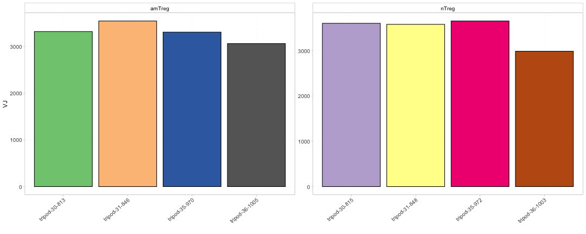

### Detailed repertoire level statistics

<table class="table" style="font-size: 10px; width: auto !important; ">
 <thead>
  <tr>
   <th style="text-align:left;color: #022f5a !important;font-size: 12px;"> V </th>
   <th style="text-align:right;color: #022f5a !important;font-size: 12px;"> tripod-30-813 </th>
   <th style="text-align:right;color: #022f5a !important;font-size: 12px;"> tripod-30-815 </th>
   <th style="text-align:right;color: #022f5a !important;font-size: 12px;"> tripod-31-846 </th>
   <th style="text-align:right;color: #022f5a !important;font-size: 12px;"> tripod-31-848 </th>
   <th style="text-align:right;color: #022f5a !important;font-size: 12px;"> tripod-35-970 </th>
   <th style="text-align:right;color: #022f5a !important;font-size: 12px;"> tripod-35-972 </th>
   <th style="text-align:right;color: #022f5a !important;font-size: 12px;"> tripod-36-1003 </th>
   <th style="text-align:right;color: #022f5a !important;font-size: 12px;"> tripod-36-1005 </th>
  </tr>
 </thead>
<tbody>
  <tr>
   <td style="text-align:left;"> TRAV1 </td>
   <td style="text-align:right;"> 1915 </td>
   <td style="text-align:right;"> 3824 </td>
   <td style="text-align:right;"> 5250 </td>
   <td style="text-align:right;"> 4036 </td>
   <td style="text-align:right;"> 5049 </td>
   <td style="text-align:right;"> 6052 </td>
   <td style="text-align:right;"> 4955 </td>
   <td style="text-align:right;"> 8122 </td>
  </tr>
  <tr>
   <td style="text-align:left;"> TRAV10 </td>
   <td style="text-align:right;"> 12404 </td>
   <td style="text-align:right;"> 17348 </td>
   <td style="text-align:right;"> 23823 </td>
   <td style="text-align:right;"> 17656 </td>
   <td style="text-align:right;"> 18459 </td>
   <td style="text-align:right;"> 34393 </td>
   <td style="text-align:right;"> 25656 </td>
   <td style="text-align:right;"> 29365 </td>
  </tr>
  <tr>
   <td style="text-align:left;"> TRAV10D </td>
   <td style="text-align:right;"> 2477 </td>
   <td style="text-align:right;"> 3440 </td>
   <td style="text-align:right;"> 4599 </td>
   <td style="text-align:right;"> 3683 </td>
   <td style="text-align:right;"> 3222 </td>
   <td style="text-align:right;"> 7165 </td>
   <td style="text-align:right;"> 5341 </td>
   <td style="text-align:right;"> 6051 </td>
  </tr>
  <tr>
   <td style="text-align:left;"> TRAV10N </td>
   <td style="text-align:right;"> 4973 </td>
   <td style="text-align:right;"> 6274 </td>
   <td style="text-align:right;"> 8459 </td>
   <td style="text-align:right;"> 8024 </td>
   <td style="text-align:right;"> 8268 </td>
   <td style="text-align:right;"> 15680 </td>
   <td style="text-align:right;"> 10952 </td>
   <td style="text-align:right;"> 12039 </td>
  </tr>
  <tr>
   <td style="text-align:left;"> TRAV11 </td>
   <td style="text-align:right;"> 2750 </td>
   <td style="text-align:right;"> 4293 </td>
   <td style="text-align:right;"> 6675 </td>
   <td style="text-align:right;"> 5054 </td>
   <td style="text-align:right;"> 8001 </td>
   <td style="text-align:right;"> 7320 </td>
   <td style="text-align:right;"> 5228 </td>
   <td style="text-align:right;"> 8390 </td>
  </tr>
  <tr>
   <td style="text-align:left;"> TRAV11N </td>
   <td style="text-align:right;"> 638 </td>
   <td style="text-align:right;"> 356 </td>
   <td style="text-align:right;"> 379 </td>
   <td style="text-align:right;"> 505 </td>
   <td style="text-align:right;"> 485 </td>
   <td style="text-align:right;"> 538 </td>
   <td style="text-align:right;"> 661 </td>
   <td style="text-align:right;"> 519 </td>
  </tr>
</tbody>
</table>

## Diversity estimation 

### Rarefaction analysis

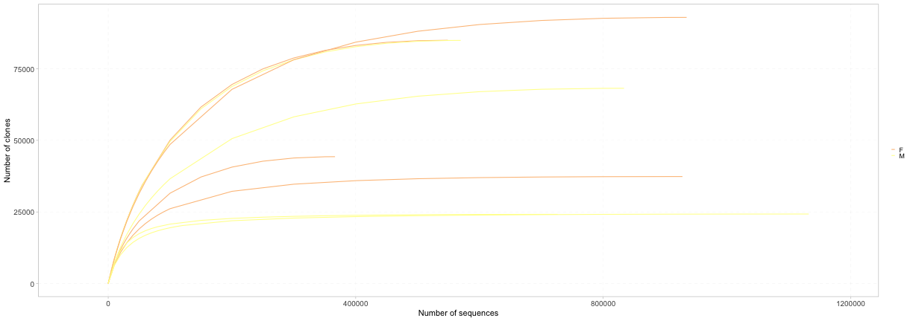

### Diversity indices

### Renyi index

## Clonal distribution

### Per count interval

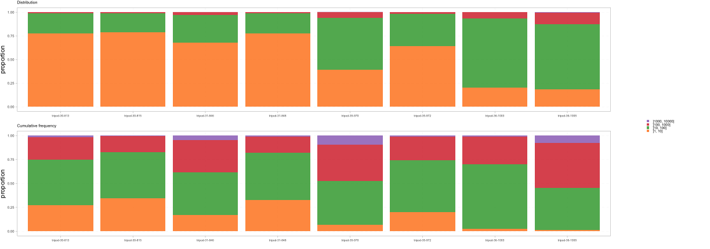

### Per decreasing rank

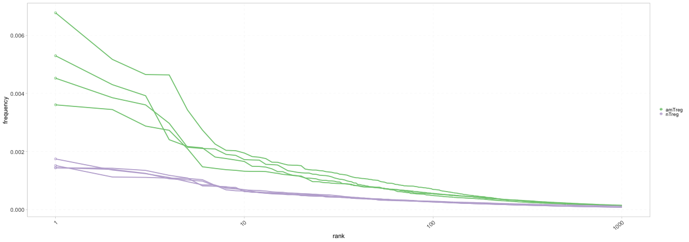

# One-sample analysis

### Clonal distribution per count intervals

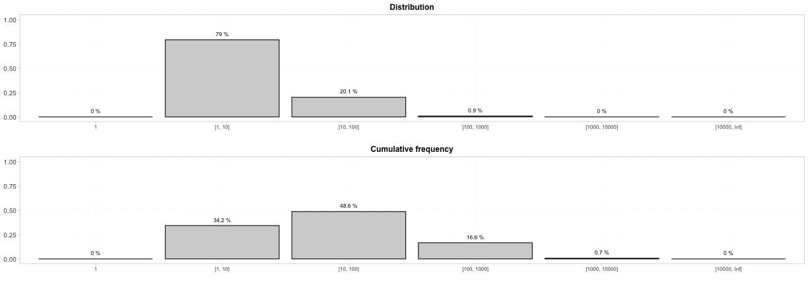

### V/J usage

### V-J combination usage

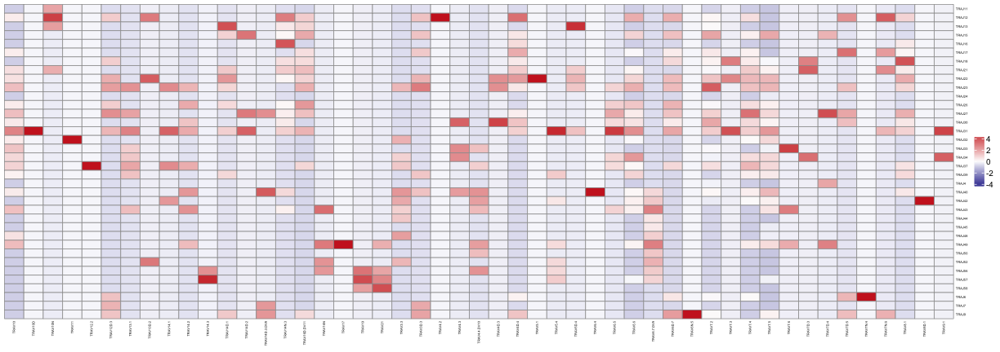

### Stacked spectratyping

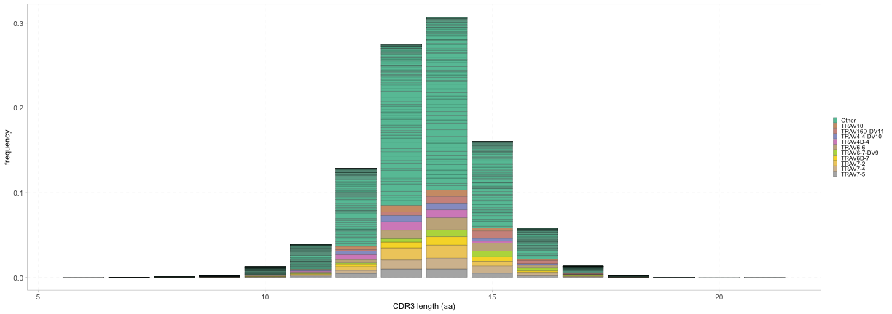

### Individual spectratyping

# Multi-sample analysis

## Comparison of basic statistics

### Metadata statistics

### Diversity indices

### Renyi index

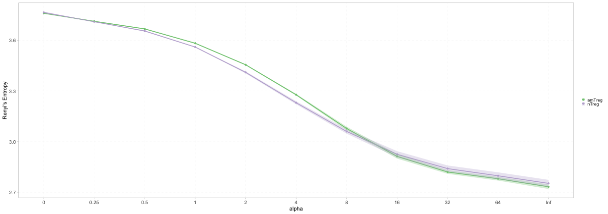

### Count intervals

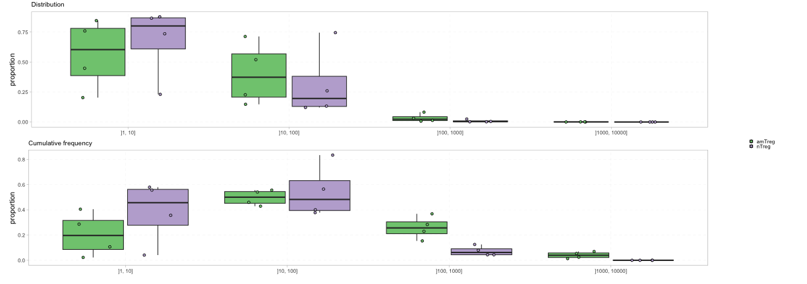

### V/J usage

 

## Similarity analysis

### Repertoire overlap

### Repertoire correlation

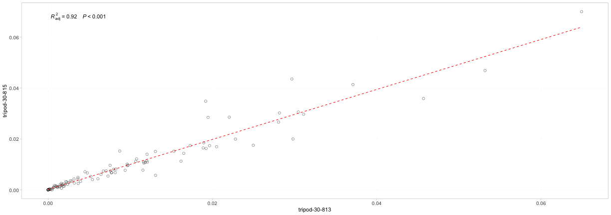

### Hierarchical clustering

### Multidimensional scaling

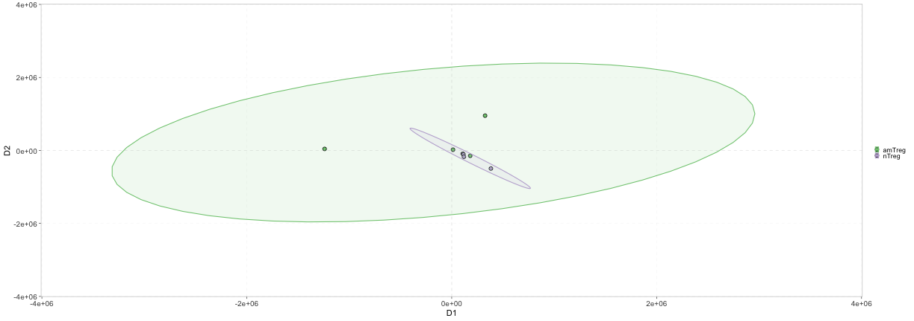

## Differential analysis

### Volcano plot

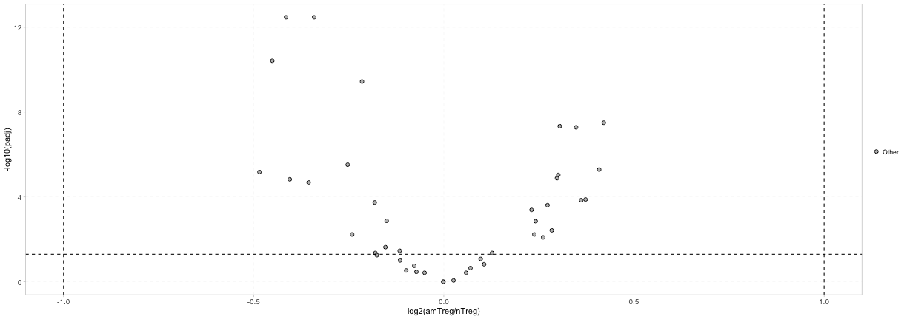

### Principal component analysis

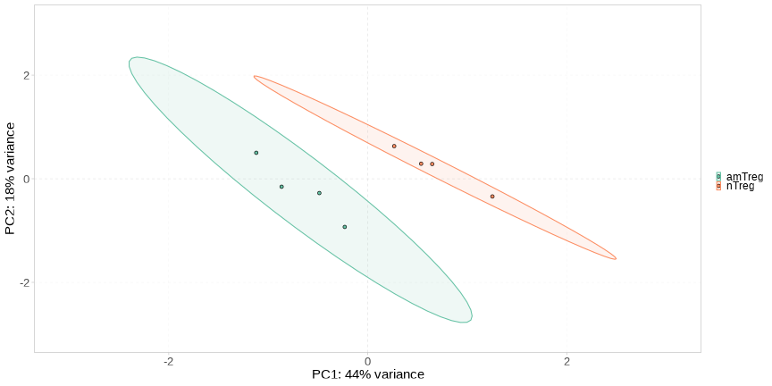

## Spectractyping comparison

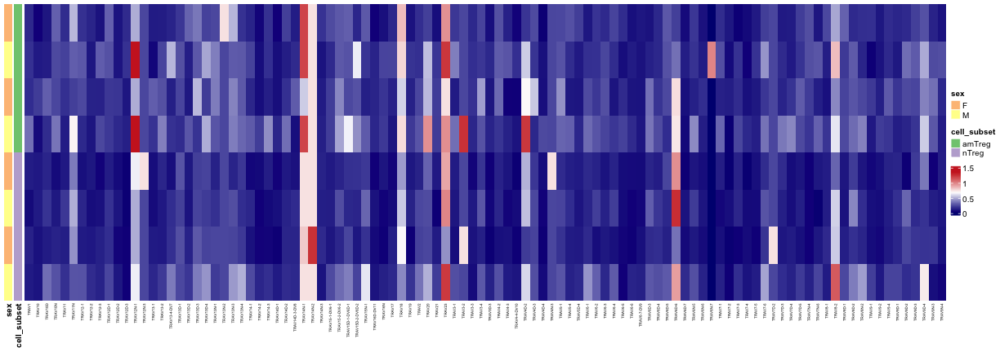

