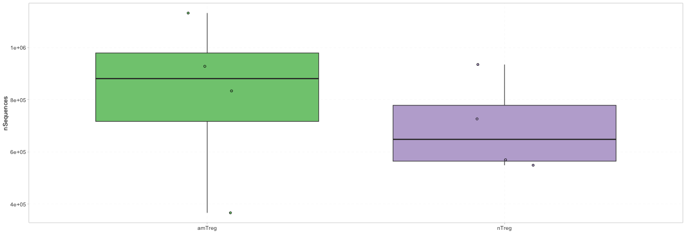

<!--html_preserve--><body style="color: white;">

<label class="control-label" id="title-label" for="title">Enter title</label>
<input id="title" type="text" class="form-control" value="Analysis report"/>

</body><!--/html_preserve-->

<!--html_preserve--><body style="color: white;">

<label class="control-label" id="authors-label" for="authors">Enter authors</label>
<input id="authors" type="text" class="form-control" value=""/>

</body><!--/html_preserve-->

# Exploratory statistics

## Basic statistics

### Metadata statistics

<!--html_preserve--><body style="color: white;">

<label class="control-label" id="metadatastatsText-label" for="metadatastatsText">Enter text</label>
<input id="metadatastatsText" type="text" class="form-control" value=""/>

</body><!--/html_preserve-->

## Diversity estimation 

### Rarefaction analysis

<!--html_preserve--><body style="color: white;">

<label class="control-label" id="rarefactionText-label" for="rarefactionText">Enter text</label>
<input id="rarefactionText" type="text" class="form-control" value=""/>

</body><!--/html_preserve-->

<table class="table" style="font-size: 10px; width: auto !important; margin-left: auto; margin-right: auto;">
 <thead>
  <tr>
   <th style="text-align:left;color: #022f5a !important;font-size: 12px;"> sample_id </th>
   <th style="text-align:right;color: #022f5a !important;font-size: 12px;"> x </th>
   <th style="text-align:right;color: #022f5a !important;font-size: 12px;"> y </th>
  </tr>
 </thead>
<tbody>
  <tr>
   <td style="text-align:left;"> tripod-30-813 </td>
   <td style="text-align:right;"> 0 </td>
   <td style="text-align:right;"> 0.000 </td>
  </tr>
  <tr>
   <td style="text-align:left;"> tripod-30-813 </td>
   <td style="text-align:right;"> 5000 </td>
   <td style="text-align:right;"> 3965.740 </td>
  </tr>
  <tr>
   <td style="text-align:left;"> tripod-30-813 </td>
   <td style="text-align:right;"> 10000 </td>
   <td style="text-align:right;"> 7021.439 </td>
  </tr>
  <tr>
   <td style="text-align:left;"> tripod-30-813 </td>
   <td style="text-align:right;"> 15000 </td>
   <td style="text-align:right;"> 9615.180 </td>
  </tr>
  <tr>
   <td style="text-align:left;"> tripod-30-813 </td>
   <td style="text-align:right;"> 20000 </td>
   <td style="text-align:right;"> 11894.572 </td>
  </tr>
  <tr>
   <td style="text-align:left;"> tripod-30-813 </td>
   <td style="text-align:right;"> 25000 </td>
   <td style="text-align:right;"> 13936.654 </td>
  </tr>
</tbody>
</table>

### Diversity indices

<!--html_preserve--><body style="color: white;">

<label class="control-label" id="divindText-label" for="divindText">Enter text</label>
<input id="divindText" type="text" class="form-control" value=""/>

</body><!--/html_preserve-->

<table class="table" style="font-size: 10px; width: auto !important; margin-left: auto; margin-right: auto;">
 <thead>
  <tr>
   <th style="text-align:left;color: #022f5a !important;font-size: 12px;"> sample_id </th>
   <th style="text-align:right;color: #022f5a !important;font-size: 12px;"> shannon </th>
   <th style="text-align:right;color: #022f5a !important;font-size: 12px;"> simpson </th>
   <th style="text-align:right;color: #022f5a !important;font-size: 12px;"> invsimpson </th>
   <th style="text-align:right;color: #022f5a !important;font-size: 12px;"> bergerparker </th>
   <th style="text-align:right;color: #022f5a !important;font-size: 12px;"> gini </th>
   <th style="text-align:right;color: #022f5a !important;font-size: 12px;"> chao1 </th>
   <th style="text-align:right;color: #022f5a !important;font-size: 12px;"> chao1.se </th>
   <th style="text-align:right;color: #022f5a !important;font-size: 12px;"> iChao </th>
  </tr>
 </thead>
<tbody>
  <tr>
   <td style="text-align:left;"> tripod-30-813 </td>
   <td style="text-align:right;"> 4.03 </td>
   <td style="text-align:right;"> 0.98 </td>
   <td style="text-align:right;"> 41.66 </td>
   <td style="text-align:right;"> 2.73 </td>
   <td style="text-align:right;"> 0.57 </td>
   <td style="text-align:right;"> 98 </td>
   <td style="text-align:right;"> 0 </td>
   <td style="text-align:right;"> 98 </td>
  </tr>
  <tr>
   <td style="text-align:left;"> tripod-30-815 </td>
   <td style="text-align:right;"> 4.02 </td>
   <td style="text-align:right;"> 0.98 </td>
   <td style="text-align:right;"> 40.59 </td>
   <td style="text-align:right;"> 2.66 </td>
   <td style="text-align:right;"> 0.58 </td>
   <td style="text-align:right;"> 99 </td>
   <td style="text-align:right;"> NaN </td>
   <td style="text-align:right;"> 99 </td>
  </tr>
  <tr>
   <td style="text-align:left;"> tripod-31-846 </td>
   <td style="text-align:right;"> 4.06 </td>
   <td style="text-align:right;"> 0.98 </td>
   <td style="text-align:right;"> 43.72 </td>
   <td style="text-align:right;"> 2.83 </td>
   <td style="text-align:right;"> 0.55 </td>
   <td style="text-align:right;"> 98 </td>
   <td style="text-align:right;"> NaN </td>
   <td style="text-align:right;"> 98 </td>
  </tr>
  <tr>
   <td style="text-align:left;"> tripod-31-848 </td>
   <td style="text-align:right;"> 4.00 </td>
   <td style="text-align:right;"> 0.97 </td>
   <td style="text-align:right;"> 39.96 </td>
   <td style="text-align:right;"> 2.65 </td>
   <td style="text-align:right;"> 0.56 </td>
   <td style="text-align:right;"> 95 </td>
   <td style="text-align:right;"> NaN </td>
   <td style="text-align:right;"> 95 </td>
  </tr>
  <tr>
   <td style="text-align:left;"> tripod-35-970 </td>
   <td style="text-align:right;"> 4.03 </td>
   <td style="text-align:right;"> 0.97 </td>
   <td style="text-align:right;"> 39.42 </td>
   <td style="text-align:right;"> 2.41 </td>
   <td style="text-align:right;"> 0.54 </td>
   <td style="text-align:right;"> 95 </td>
   <td style="text-align:right;"> NaN </td>
   <td style="text-align:right;"> 95 </td>
  </tr>
  <tr>
   <td style="text-align:left;"> tripod-35-972 </td>
   <td style="text-align:right;"> 4.00 </td>
   <td style="text-align:right;"> 0.97 </td>
   <td style="text-align:right;"> 38.40 </td>
   <td style="text-align:right;"> 2.61 </td>
   <td style="text-align:right;"> 0.59 </td>
   <td style="text-align:right;"> 100 </td>
   <td style="text-align:right;"> 0 </td>
   <td style="text-align:right;"> 100 </td>
  </tr>
</tbody>
</table>

# Multi-sample analysis

## Comparison of basic statistics

### Metadata statistics

<!--html_preserve--><body style="color: white;">

<label class="control-label" id="statsText-label" for="statsText">Enter text</label>
<input id="statsText" type="text" class="form-control" value=""/>

</body><!--/html_preserve-->

