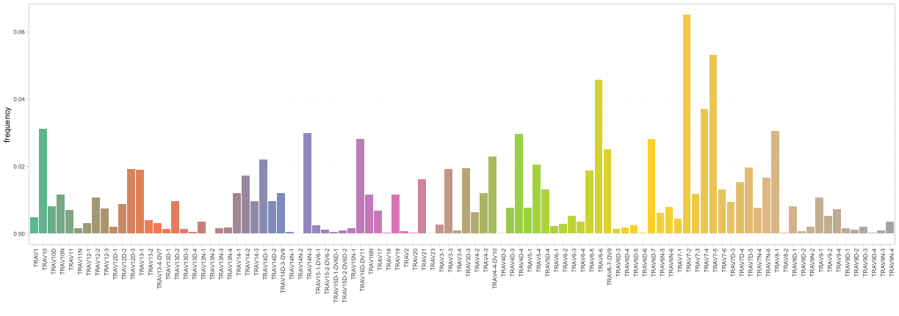
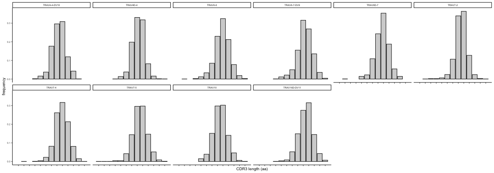

This file is generated automatically, this is a summary report of your actions on Shiny AnalyzAIRR.

# Data manipulation

## Filtering

**Filter out a repertoire level count**

<table class="table" style="font-size: 10px; width: auto !important; ">
 <thead>
  <tr>
   <th style="text-align:left;color: #022f5a !important;font-size: 12px;"> history </th>
  </tr>
 </thead>
<tbody>
  <tr>
   <td style="text-align:left;"> data directory=/mnt/mukkuri/RepSeq/RS_Analysis/GPI/AnalyzAIRR/extdata/mixcr </td>
  </tr>
  <tr>
   <td style="text-align:left;"> readAIRRSet; cores=2; fileFormat=MiXCR; chain=TRA; ambiguous FALSE; unprod FALSE; filter.singletons TRUE; aa threshold=8; raretab FALSE </td>
  </tr>
  <tr>
   <td style="text-align:left;"> 114783 clonotype were filtered using filterCount: n= 1 and group= </td>
  </tr>
  <tr>
   <td style="text-align:left;"> 0 CDR3nt were filtered using filterCount: n= 1 and group= cell_subset </td>
  </tr>
  <tr>
   <td style="text-align:left;"> 0 CDR3nt were filtered using filterCount: n= 1 and group= amTreg </td>
  </tr>
</tbody>
</table>

# Exploratory statistics

## Basic statistics

### Metadata statistics

### Detailed repertoire level statistics

<table class="table" style="font-size: 10px; width: auto !important; ">
 <thead>
  <tr>
   <th style="text-align:left;color: #022f5a !important;font-size: 12px;"> J </th>
   <th style="text-align:right;color: #022f5a !important;font-size: 12px;"> tripod-30-813 </th>
   <th style="text-align:right;color: #022f5a !important;font-size: 12px;"> tripod-30-815 </th>
   <th style="text-align:right;color: #022f5a !important;font-size: 12px;"> tripod-31-846 </th>
   <th style="text-align:right;color: #022f5a !important;font-size: 12px;"> tripod-31-848 </th>
   <th style="text-align:right;color: #022f5a !important;font-size: 12px;"> tripod-35-970 </th>
   <th style="text-align:right;color: #022f5a !important;font-size: 12px;"> tripod-35-972 </th>
   <th style="text-align:right;color: #022f5a !important;font-size: 12px;"> tripod-36-1003 </th>
   <th style="text-align:right;color: #022f5a !important;font-size: 12px;"> tripod-36-1005 </th>
  </tr>
 </thead>
<tbody>
  <tr>
   <td style="text-align:left;"> TRAJ11 </td>
   <td style="text-align:right;"> 0.0084494 </td>
   <td style="text-align:right;"> 0.0109075 </td>
   <td style="text-align:right;"> 0.0084581 </td>
   <td style="text-align:right;"> 0.0111792 </td>
   <td style="text-align:right;"> 0.0110723 </td>
   <td style="text-align:right;"> 0.0107598 </td>
   <td style="text-align:right;"> 0.0112040 </td>
   <td style="text-align:right;"> 0.0101257 </td>
  </tr>
  <tr>
   <td style="text-align:left;"> TRAJ12 </td>
   <td style="text-align:right;"> 0.0434363 </td>
   <td style="text-align:right;"> 0.0467086 </td>
   <td style="text-align:right;"> 0.0392006 </td>
   <td style="text-align:right;"> 0.0462095 </td>
   <td style="text-align:right;"> 0.0403199 </td>
   <td style="text-align:right;"> 0.0430802 </td>
   <td style="text-align:right;"> 0.0437467 </td>
   <td style="text-align:right;"> 0.0461757 </td>
  </tr>
  <tr>
   <td style="text-align:left;"> TRAJ13 </td>
   <td style="text-align:right;"> 0.0248964 </td>
   <td style="text-align:right;"> 0.0265830 </td>
   <td style="text-align:right;"> 0.0226640 </td>
   <td style="text-align:right;"> 0.0267398 </td>
   <td style="text-align:right;"> 0.0276702 </td>
   <td style="text-align:right;"> 0.0248721 </td>
   <td style="text-align:right;"> 0.0264250 </td>
   <td style="text-align:right;"> 0.0233273 </td>
  </tr>
  <tr>
   <td style="text-align:left;"> TRAJ15 </td>
   <td style="text-align:right;"> 0.0361764 </td>
   <td style="text-align:right;"> 0.0470729 </td>
   <td style="text-align:right;"> 0.0400716 </td>
   <td style="text-align:right;"> 0.0490207 </td>
   <td style="text-align:right;"> 0.0367642 </td>
   <td style="text-align:right;"> 0.0459912 </td>
   <td style="text-align:right;"> 0.0447048 </td>
   <td style="text-align:right;"> 0.0373860 </td>
  </tr>
  <tr>
   <td style="text-align:left;"> TRAJ16 </td>
   <td style="text-align:right;"> 0.0181176 </td>
   <td style="text-align:right;"> 0.0138362 </td>
   <td style="text-align:right;"> 0.0118903 </td>
   <td style="text-align:right;"> 0.0132596 </td>
   <td style="text-align:right;"> 0.0122879 </td>
   <td style="text-align:right;"> 0.0132949 </td>
   <td style="text-align:right;"> 0.0136481 </td>
   <td style="text-align:right;"> 0.0136188 </td>
  </tr>
  <tr>
   <td style="text-align:left;"> TRAJ17 </td>
   <td style="text-align:right;"> 0.0254176 </td>
   <td style="text-align:right;"> 0.0262187 </td>
   <td style="text-align:right;"> 0.0229026 </td>
   <td style="text-align:right;"> 0.0265330 </td>
   <td style="text-align:right;"> 0.0272798 </td>
   <td style="text-align:right;"> 0.0278149 </td>
   <td style="text-align:right;"> 0.0288202 </td>
   <td style="text-align:right;"> 0.0248371 </td>
  </tr>
</tbody>
</table>

## Diversity estimation 

### Rarefaction analysis

### Diversity indices

# One-sample analysis

### Clonal distribution per count intervals

### V/J usage

### Stacked spectratyping

### Individual spectratyping

 

