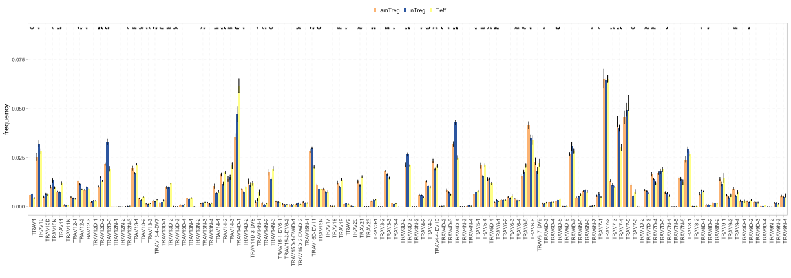

<style type="text/css">
<!-- div#TOC li { -->
<!--     list-style:none; -->
<!--     background-image:none; -->
<!--     background-repeat:none; -->
<!--     background-position:0;  -->
<!-- } -->
 .book .book-body .page-inner  { 
    max-width: 1400px; 
 <!-- width: 120%;  -->
 } 
 .column-left {
  float: left;
  width: 49.7%;
}
.column-right{
 float: right;
  width: 49.7%;
}
.col2 {
    columns: 2 200px;         /* number of columns and width in pixels*/
    -webkit-columns: 2 200px; /* chrome, safari */
    -moz-columns: 2 200px;    /* firefox */
  }
h1 {
  color: #033c73;
   font-size: 30px;
}
h1.title {
  color: #033c73;
}
h2 {
  color: #033c73;
  font-size: 24px;
}
h3 {
   color: #033c73;
   font-size: 18px;
}
h4 {
   color: #022f5a;
}
h5 {
  color: #033c73;
}
h6 {
   color: #033c73;
}
body{ 
  font-size: 14px;
}
p.caption {
  font-size: 0.9em;
  font-style: italic;
  color: grey;
  margin-right: 10%;
  margin-left: 10%;  
  text-align: justify;
} 
#renderedReport p{
  color: white;
}

</style>


<!--html_preserve--><body style="color: white;">
<p style="color: white;">
<div class="form-group shiny-input-container">
<label class="control-label" id="title-label" for="title">Enter title</label>
<input id="title" type="text" class="form-control" value="Analysis report"/>
</div>
</p>
</body><!--/html_preserve-->


<!--html_preserve--><body style="color: white;">
<p style="color: white;">
<div class="form-group shiny-input-container">
<label class="control-label" id="authors-label" for="authors">Enter authors</label>
<input id="authors" type="text" class="form-control" value=""/>
</div>
</p>
</body><!--/html_preserve-->


```
## Error in eval(expr, envir, enclos): object 'params' not found
```


```
## Error in eval(expr, envir, enclos): object 'params' not found
```


# Exploratory statistics


```
## Error in eval(expr, envir, enclos): object 'params' not found
```


<!-- ```{r count features, echo=FALSE, warning=FALSE, message=FALSE, error=TRUE, fig.width=17, fig.height=6, fig.align='center'} -->
<!-- if(input$countLevel != "" && !is.null(input$countScale)){ -->
<!--    countfeatures <- countFeatures(x=dataFilt(), level = input$countLevel, scale = input$countScale, group = NULL) -->
<!--    knitr::kable(head(countfeatures)) %>% -->
<!--     kableExtra::kable_styling( -->
<!--                     full_width = FALSE, -->
<!--                     position = "center", -->
<!--                     font_size = 10) %>% -->
<!--     kableExtra::row_spec(0, color="#022f5a", font_size = 12)       -->
<!-- } -->

<!-- ``` -->


## Diversity estimation 

### Rarefaction analysis


```
## Error in `ggplot2::geom_line()`:
## ! Problem while computing aesthetics.
## ℹ Error occurred in the 1st layer.
## Caused by error in `FUN()`:
## ! object 'groupb' not found
```

<!--html_preserve--><body style="color: white;">
<p style="color: white;">
<div class="form-group shiny-input-container">
<label class="control-label" id="rarefactionText-label" for="rarefactionText">Enter text</label>
<input id="rarefactionText" type="text" class="form-control" value=""/>
</div>
</p>
</body><!--/html_preserve-->


<!-- ```{r rarefaction tab,  echo=FALSE, warning=FALSE, message=FALSE, error=TRUE, fig.width=17, fig.height=6, fig.align='center'} -->
<!-- if(!is.null(input$plotRare)){ -->
<!--    raretab <- rarefactionTab(x = dataFilt()) -->
<!--    knitr::kable(head(raretab)) %>% -->
<!--             kableExtra::kable_styling( -->
<!--                     full_width = FALSE, -->
<!--                     position = "center", -->
<!--                     font_size = 10) %>% -->
<!--             kableExtra::row_spec(0, color="#022f5a", font_size = 12) -->
<!-- } -->

<!-- ``` -->


<!-- ```{r div ind tab,  echo=FALSE, warning=FALSE, message=FALSE, error=TRUE, fig.width=17, fig.height=6, fig.align='center'} -->
<!-- if(input$divLevel != ""){ -->
<!--    divind <- diversityIndices(x=dataFilt(), level = input$divLevel) -->
<!--    knitr::kable(head(divind)) %>% -->
<!--             kableExtra::kable_styling( -->
<!--                     full_width = FALSE, -->
<!--                     position = "center", -->
<!--                     font_size = 10) %>% -->
<!--             kableExtra::row_spec(0, color="#022f5a", font_size = 12)  -->
<!-- } -->

<!-- ``` -->


<!-- ```{r renyi ind tab,  echo=FALSE, warning=FALSE, message=FALSE, error=TRUE, fig.width=17, fig.height=6, fig.align='center'} -->
<!-- if(input$renyiLevel != ""){ -->
<!--    renind <- renyiIndex(x=dataFilt(), level = input$renyiLevel) -->
<!--    knitr::kable(head(renind)) %>% -->
<!--             kableExtra::kable_styling( -->
<!--                     full_width = FALSE, -->
<!--                     position = "center", -->
<!--                     font_size = 10) %>% -->
<!--             kableExtra::row_spec(0, color="#022f5a", font_size = 12)  -->
<!-- } -->

<!-- ``` -->


# One-sample analysis


### Stacked spectratyping


<!--html_preserve--><body style="color: white;">
<p style="color: white;">
<div class="form-group shiny-input-container">
<label class="control-label" id="cd3spectraText-label" for="cd3spectraText">Enter text</label>
<input id="cd3spectraText" type="text" class="form-control" value=""/>
</div>
</p>
</body><!--/html_preserve-->


### Individual spectratyping


<!--html_preserve--><body style="color: white;">
<p style="color: white;">
<div class="form-group shiny-input-container">
<label class="control-label" id="cd3spectraindText-label" for="cd3spectraindText">Enter text</label>
<input id="cd3spectraindText" type="text" class="form-control" value=""/>
</div>
</p>
</body><!--/html_preserve-->


# Multi-sample analysis


## Comparison of basic statistics


<!--html_preserve--><body style="color: white;">
<p style="color: white;">
<div class="form-group shiny-input-container">
<label class="control-label" id="divText-label" for="divText">Enter text</label>
<input id="divText" type="text" class="form-control" value=""/>
</div>
</p>
</body><!--/html_preserve-->


### Renyi index


```
## Error in match.arg(level): 'arg' should be one of "aaClone", "ntClone", "V", "J", "VJ", "ntCDR3", "aaCDR3"
```

<!--html_preserve--><body style="color: white;">
<p style="color: white;">
<div class="form-group shiny-input-container">
<label class="control-label" id="renyiText-label" for="renyiText">Enter text</label>
<input id="renyiText" type="text" class="form-control" value=""/>
</div>
</p>
</body><!--/html_preserve-->


### Count intervals


```
## Error in `[.data.frame`(sdata, , colorBy): undefined columns selected
```

<!--html_preserve--><body style="color: white;">
<p style="color: white;">
<div class="form-group shiny-input-container">
<label class="control-label" id="countIntText-label" for="countIntText">Enter text</label>
<input id="countIntText" type="text" class="form-control" value=""/>
</div>
</p>
</body><!--/html_preserve-->


### Rank distribution


```
## Error in match.arg(scale): 'arg' should be one of "count", "frequency"
```

<!--html_preserve--><body style="color: white;">
<p style="color: white;">
<div class="form-group shiny-input-container">
<label class="control-label" id="rankDistribText-label" for="rankDistribText">Enter text</label>
<input id="rankDistribText" type="text" class="form-control" value=""/>
</div>
</p>
</body><!--/html_preserve-->


### V/J usage



<!--html_preserve--><body style="color: white;">
<p style="color: white;">
<div class="form-group shiny-input-container">
<label class="control-label" id="geneUsageText-label" for="geneUsageText">Enter text</label>
<input id="geneUsageText" type="text" class="form-control" value=""/>
</div>
</p>
</body><!--/html_preserve-->


<!-- ```{r diffExpGroup, echo=FALSE, warning=FALSE, message=FALSE, error=TRUE, fig.width=17, fig.height=6, fig.align='center'} -->
<!-- if(!is.null(input$diffGroup) && !is.null(input$diffLevel)){ -->
<!--     diffexp <- diffExpGroup(x = dataFilt(), colGrp = input$diffGroup[[1]], level = input$diffLevel, group = input$diffGroup) -->
<!--     knitr::kable(head(diffexp)) %>% -->
<!--             kableExtra::kable_styling( -->
<!--                     full_width = FALSE, -->
<!--                     position = "center", -->
<!--                     font_size = 10) %>% -->
<!--             kableExtra::row_spec(0, color="#022f5a", font_size = 12)  -->
<!-- } -->

<!-- ``` -->


<!-- ```{r spectratyping comparison table, echo=FALSE, warning=FALSE, message=FALSE, error=TRUE, fig.width=17, fig.height=6, fig.align='center'} -->
<!-- if(!is.null(input$PertGroupSelected) && !is.null(input$CtrlGroup) && !is.null(input$pertDist) && !is.null(input$pertOrder) && input$doHm == 1){ -->
<!--     sampleinfo <- mData(dataFilt()) -->
<!--     ctrnames <- rownames(sampleinfo)[which(sampleinfo[, input$PertGroupSelected] %in% input$CtrlGroup)] -->
<!--     pertscore <- perturbationScore(x = dataFilt(), ctrl.names = ctrnames, distance = input$pertDist, p = 2) -->
<!--     knitr::kable(head(pertscore)) %>% -->
<!--             kableExtra::kable_styling( -->
<!--                     full_width = FALSE, -->
<!--                     position = "center", -->
<!--                     font_size = 10) %>% -->
<!--             kableExtra::row_spec(0, color="#022f5a", font_size = 12) -->
<!-- } -->

<!-- ``` -->


